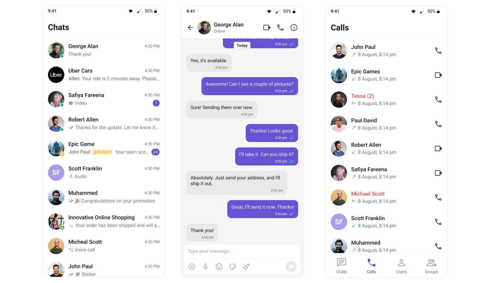
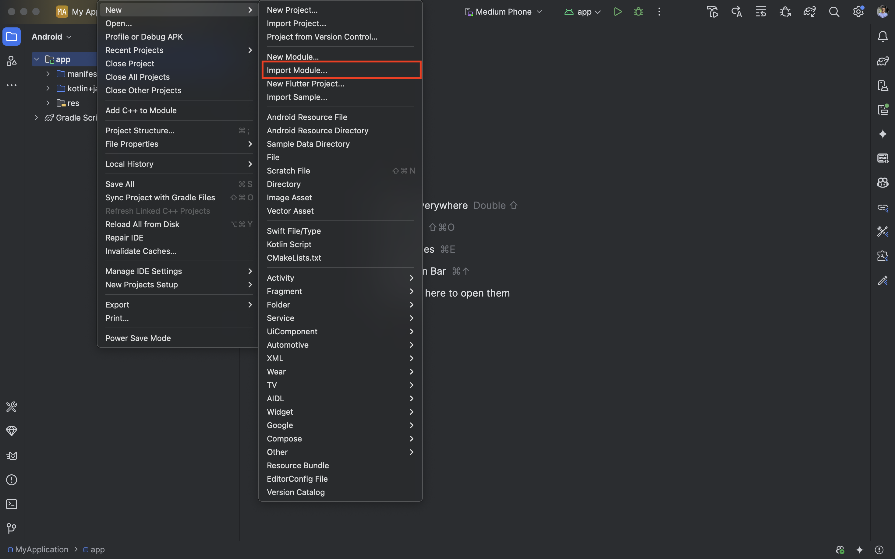
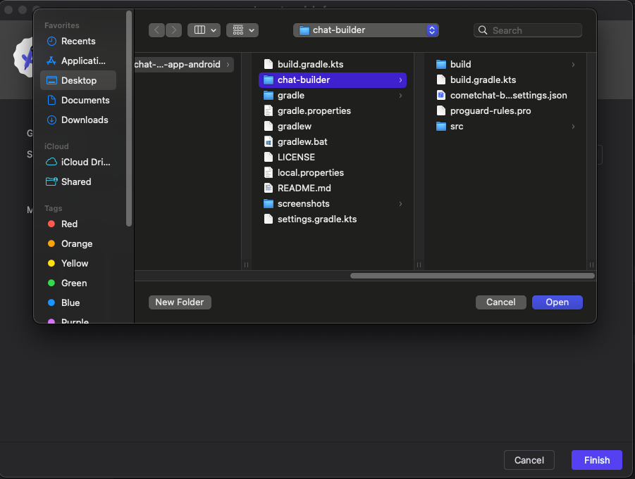

<p align="center">
  
</p>

# CometChat Android UI Kit

The CometChat Android UI Kit provides a pre-built user interface kit that developers can use to quickly integrate a reliable & fully-featured chat
experience into an existing or a new app.

<div style="
    display: flex;
    align-items: center;
    justify-content: center;">
   
</div>

## Prerequisites

Before running this project, make sure you have:

- **Android Studio** (latest version recommended)
- **Android Device or Emulator** with Android API level 26 (Android 8.0) or above
- **Java 11** or above
- **Internet connection** (required for CometChat services)

---

## How to Configure Your Own Application with CometChatBuilder Settings

This sample app demonstrates the usage of **CometChat Builder** configuration system. You can easily integrate the same configuration system into your own Android application by following these guided steps:

### What is CometChat Builder?

CometChat Builder is CometChat's configuration system that allows you to customize chat features, UI components, and styling through a simple JSON configuration file. The builder plugin automatically generates Kotlin constants and applies styling based on your configuration.

---

## ⚡ Option 1: Import the CometChatBuilder Sample App Directly as a Module

You can use the pre-configured **CometChatBuilder Sample App** directly in your project as a module. This option is ideal if you want a ready-made module to plug-and-play, or wish to migrate features from the sample app to your main app.

### Steps to Import the Sample App as a Module

**Step 1:** Run the Sample App which is downloaded from the CometChat dashboard.

**Step 2:** Update `AndroidManifest.xml` of the sample app
- In the `<application>` tag, **remove all attributes except** `android:name`.
- If your app already has its own `Application` class, remove the Sample App's `android:name` from the `<application>` tag and and extend your application class with `BuilderApplication`.

**Step 3:** Update App-level `build.gradle.kts`  
- Remove `com.cometchat.builder.settings` from the `plugins` block.
- Change `id("com.android.application")` to `id("com.android.library")`.

  **Example:**
  ```kotlin
  plugins {
      id("com.android.library")
      kotlin("android")
  }
  ```
  ***Note - If you have a Java Project then -***
  - Change `kotlin("android")` to `id("org.jetbrains.kotlin.android") version "2.2.20"`.
  
**Step 4:** In your project Import it as a Module. 
- In Android Studio:  
  `File` → `New` → `Import Module` → Select the sample app folder.
- See the screenshots below for reference:

<p align="center">
  
</p>
<p align="center">
  
</p>

**Step 5:** Add the Module Dependency  
- In your app module's `build.gradle.kts`:
  ```kotlin
  implementation(project(":chat-builder"))
  ```

**Step 6:** Add Jetifier Flag  
- In `gradle.properties`:
  ```
  android.enableJetifier=true
  ```

**Step 7:** Add CometChat Repository  
- In `dependencyResolutionManagement` in `settings.gradle.kts`:
  ```kotlin
  maven("https://dl.cloudsmith.io/public/cometchat/cometchat/maven/")
  ```

**Step 8:** Verify the Module  
- Ensure the imported module is visible in your project and contains all necessary files.

**Step 9:** Launch Activities as Needed
- If CometChat is **not initialized** or the user is **not logged in**:
  ```kotlin
  val intent = Intent(this@YourActivity, SplashActivity::class.java)
  startActivity(intent)
  ```
- If the CometChat user is **logged in**:
  ```kotlin
  val intent = Intent(this@YourActivity, HomeActivity::class.java)
  startActivity(intent)
  ```

- If CometChat is **initialized** and user is **logged in** and want to open Messages Screen:

  In case of ***User*** -
  ```kotlin
  val UID: String = "UID"
  val intent = Intent(this@YourActivity, MessagesActivity::class.java)
  CometChat.getUser(UID, object : CometChat.CallbackListener<User?>() {
      override fun onSuccess(user: User?) {
          intent.putExtra("user", com.google.gson.Gson().toJson(user))
          startActivity(intent)
      }

      override fun onError(e: CometChatException?) {
          Log.e("TAG", "Error fetching user: ${e?.message}")
      }
  })
  ```
  In case of ***Group*** -
  ```kotlin
  val GUID: String = "GUID"
  val intent = Intent(this@YourActivity, MessagesActivity::class.java)
  CometChat.getGroup(GUID, object : CometChat.CallbackListener<Group?>() {
      override fun onSuccess(group: Group?) {
          intent.putExtra("group", com.google.gson.Gson().toJson(group))
          startActivity(intent)
      }

      override fun onError(e: CometChatException?) {
          Log.e("TAG", "Error fetching group: ${e?.message}")
      }
  })
  ```

> **Important Guidelines for Changes**
>
> - **Functional Changes**:  
    For enabling or disabling features and adjusting configurations, make the necessary updates in the `CometChatBuilderSettings.kt` file. This file contains all the feature flags and configuration constants.
>
> - **UI and Theme-related Changes**:  
    For any updates related to UI, such as colors, fonts, and styles, you should apply your changes in the `themes.xml` file of the module itself.

---

## 🛠️ Option 2: Integrate CometChatBuilder via Gradle Plugin (Recommended for Customization)

### Step-by-Step Integration Guide to use CometChatBuilder in your existing project.

**Step 1:** Add the CometChat repository to your project-level `settings.gradle.kts` file in pluginManagement and dependencyResolutionManagement.
```
maven("https://dl.cloudsmith.io/public/cometchat/cometchat/maven/")
```

**Step 2:** Add Jetifier Flag
- In `gradle.properties`:
  ```
  android.enableJetifier=true
  ```

**Step 3:** Add the following chat UIKit dependency in `build.gradle.kts` of your project.
```
dependencies {
    // CometChat UIKit
    implementation 'com.cometchat:chat-uikit-android:5.1.+'

    // (Optional) Include this if your app uses voice/video calling features
    implementation 'com.cometchat:calls-sdk-android:4.1.+'
}
```

**Step 4:** Add the CometChatBuilder Plugin to Your Project

- Add the plugin to your app-level `build.gradle.kts` file:
  ```
  plugins {
      id("com.cometchat.builder.settings") version "5.0.1"
  }

  ```
- Sync your project to download the plugin dependencies.

**Step 5:** Create Your CometChat Builder Configuration File

- Copy a file named `cometchat-builder-settings.json` into your app's root directory (same level as `build.gradle.kts`).

**Step 6:** Build Your Project

- Build your project using Android Studio or run:
  ```bash
  ./gradlew build
  ```
- The Builder plugin will automatically generate an important file:
  - `CometChatBuilderSettings.kt` — Contains all feature flags and configuration constants
  - This will also add necessary styles in theme

**Step 7:** Copy the BuilderSettingsHelper

- Copy the `BuilderSettingsHelper.kt` file from this sample app to your project:
  - Source: `src/main/java/com/cometchat/builder/BuilderSettingsHelper.kt`
  - Destination: `src/main/java/com/yourpackage/BuilderSettingsHelper.kt`
  - Remove `applySettingsToBottomNavigationView` method from BuilderSettingsHelper.kt file

**Step 8:** Add the font package to your project

- Copy the `font` package from this sample app to your project:
  - Source: `src/main/res/font`
  - Destination: `src/main/res`

**Step 9:** Set the theme in `AndroidManifest.xml`
```
<application
        android:theme="@style/CometChat.Builder.Theme"
        ...
        ...
    >

    </application>
```

**Step 10:** Apply Builder Settings to Your UI Components

Now you can use the `BuilderSettingsHelper` to apply your configuration to CometChat UI components:

**Example: Applying settings to a Message List**
```kotlin
import com.example.yourpackage.BuilderSettingsHelper

class MessagesActivity : AppCompatActivity() {
    
    override fun onCreate(savedInstanceState: Bundle?) {
        super.onCreate(savedInstanceState)
        
        // Apply Builder settings to your UI components
        BuilderSettingsHelper.applySettingsToMessageHeader(binding.messageHeader)
        BuilderSettingsHelper.applySettingsToMessageList(binding.messageList)
        BuilderSettingsHelper.applySettingsToMessageComposer(binding.messageComposer)
    }
}
```

**Example: Applying settings to other components**
```kotlin
// For Users component
BuilderSettingsHelper.applySettingsToUsers(binding.users)

// For Call Logs
BuilderSettingsHelper.applySettingsToCallLogs(binding.callLog)

// For Group Members
BuilderSettingsHelper.applySettingToGroupMembers(binding.groupMembers)
```

**Step 11:** Access Builder Constants Directly

You can also access the generated constants directly in your code:

```kotlin
import com.cometchat.builder.CometChatBuilderSettings

// Check if a feature is enabled
if (CometChatBuilderSettings.ChatFeatures.CoreMessagingExperience.PHOTOSSHARING) {
    // Enable photo sharing functionality
}

// Access styling constants
val brandColor = CometChatBuilderSettings.Style.Color.BRANDCOLOR
val fontSize = CometChatBuilderSettings.Style.Typography.SIZE
```

---

## 🔎 Available Builder Settings Categories

The Builder configuration supports the following categories:

- **🔧 Core Messaging Experience** - Basic chat features (typing, file sharing, etc.)
- **🎯 Deeper User Engagement** - Advanced features (reactions, polls, translation)
- **🤖 AI User Copilot** - AI-powered features (smart replies, conversation starters)
- **👥 Group Management** - Group creation, member management
- **🛡️ Moderator Controls** - User moderation (kick, ban, promote)
- **📞 Voice & Video Calling** - Call-related features
- **🎨 Layout & Styling** - UI customization and theming

---

## 🚀 Benefits of Using CometChat Builder

✅ **Easy Configuration**: Change features without modifying code  
✅ **Type-Safe Constants**: Auto-generated Kotlin constants  
✅ **Consistent Styling**: Automatic theme generation  
✅ **Feature Toggling**: Enable/disable features dynamically  
✅ **No Code Changes**: Modify behavior through JSON configuration  

---

## 🐞 Troubleshooting Builder Integration

**Plugin Not Found:**
- Ensure you have internet connectivity during sync.
- Check that the plugin version is correct: `5.0.1`.

**CometChatBuilderSettings Not Generated:**
- Make sure `cometchat-builder-settings.json` is in the correct location.
- Clean and rebuild your project: **Build > Clean Project > Rebuild Project**.

**BuilderSettingsHelper Import Errors:**
- Verify you've updated the package declaration.
- Check that all CometChatBuilderSettings imports are correct.

---

## Need Help?

- 📖 [CometChat Documentation](https://www.cometchat.com/docs/android-uikit/integration)
- 🎫 [Create Support Ticket](https://help.cometchat.com/hc/en-us)
- 💬 [CometChat Dashboard](https://app.cometchat.com/)
